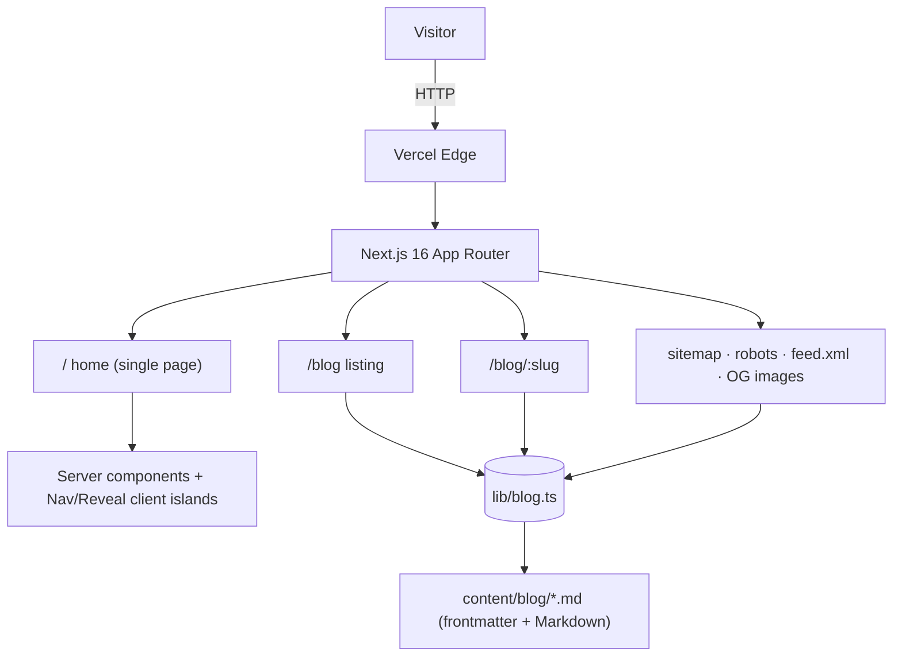

# mangatinanda.me

[](https://github.com/mangatinanda/mangatinanda.me/actions/workflows/ci.yml)

My personal portfolio and technical blog. Built with **Next.js 16**, **TypeScript**,
and **Tailwind CSS 4**, deployed on Vercel.

**Live:** https://mangatinanda.me

## Highlights

- Server-Components-first: the only client components are the nav and a tiny
  scroll-reveal wrapper — no client-side animation library
- Markdown blog pipeline: posts live in `content/blog/*.md` with frontmatter;
  reading time, dates, RSS, and sitemap `lastmod` derive from one ISO date field
- SEO and social ready: per-post Open Graph images, JSON-LD (Person +
  BlogPosting), self-referencing canonicals, `sitemap.xml`, `robots.txt`,
  `feed.xml`
- Accessible by design: reduced-motion support, skip link, landmarks,
  WCAG AA contrast, keyboard-friendly mobile menu
- Security headers, Vercel Web Analytics, CI (lint, typecheck, format, build)
- Downloadable resume, branded 404, dark minimal theme

## Tech stack

| Area      | Choice                                                     |
| --------- | ---------------------------------------------------------- |
| Framework | Next.js 16 (App Router, Turbopack)                         |
| Language  | TypeScript                                                 |
| Styling   | Tailwind CSS 4 (`@theme inline` tokens)                    |
| Animation | CSS keyframes + IntersectionObserver reveal                |
| Content   | Markdown + gray-matter + react-markdown + rehype-highlight |
| Icons     | lucide-react                                               |
| Hosting   | Vercel                                                     |

## Architecture



## Project structure

```
content/blog/          blog posts (Markdown + frontmatter)
src/
  app/                 routes, layout, metadata, sitemap.ts, robots.ts, feed.xml, OG images
  components/          hero, about, experience, skills, projects, blog cards, contact, footer
  lib/blog.ts          content pipeline (gray-matter, reading time, dates)
public/                images, resume PDF
.github/workflows/     CI (lint, typecheck, format, build)
```

## Run locally

```bash
pnpm install
pnpm dev          # http://localhost:3000
pnpm build        # production build
pnpm lint
pnpm typecheck
pnpm format
```

## Writing a blog post

Drop a Markdown file in `content/blog/<slug>.md` with frontmatter:

```yaml
---
title: "Post title"
description: "One-sentence summary used in cards, metadata, and RSS."
publishedAt: "2026-06-05"
tags: ["AI", "Architecture"]
---
```

Everything else (reading time, formatted date, sitemap entry, RSS item,
per-post OG image) is derived automatically. It renders at `/blog/<slug>`.

## Deployment

Auto-deploys on push to `main` via Vercel. Custom domain: `mangatinanda.me`.
