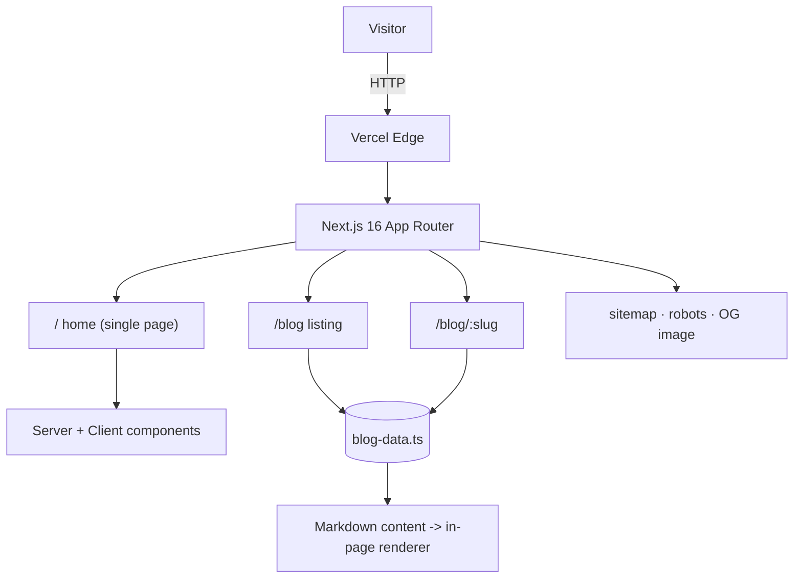

# mangatinanda.me

My personal portfolio and technical blog. Built with **Next.js 16**, **TypeScript**,
and **Tailwind CSS 4**, deployed on Vercel.

**Live:** https://mangatinanda.me

## Highlights

- Single-page portfolio (hero, about, experience, skills, projects, contact) with scroll-reveal animations
- Data-driven blog with a lightweight Markdown renderer (`/blog`, `/blog/[slug]`)
- SEO and social ready: dynamic Open Graph images, `sitemap.xml`, `robots.txt`, per-page metadata
- Downloadable resume, branded 404, dark minimal theme

## Tech stack

| Area | Choice |
|------|--------|
| Framework | Next.js 16 (App Router, Turbopack) |
| Language | TypeScript |
| Styling | Tailwind CSS 4 (`@theme inline` tokens) |
| Animation | Framer Motion |
| Icons | lucide-react |
| Hosting | Vercel |

## Architecture



## Project structure

```
src/
  app/                 routes, layout, metadata, sitemap.ts, robots.ts, opengraph-image.tsx
  components/          hero, about, experience, skills, projects, blog-preview, contact, footer
  lib/blog-data.ts     blog posts (metadata + Markdown content)
ai/                    long-form study notes (source material for blog posts)
public/                images, resume PDF
```

## Run locally

```bash
pnpm install
pnpm dev        # http://localhost:3000
pnpm build      # production build
pnpm lint
```

## Writing a blog post

Add an entry to `src/lib/blog-data.ts` with a `content` field (Markdown-ish:
`##` / `###` headings, `-` bullets, blank-line-separated paragraphs) and set
`published: true`. It renders at `/blog/<slug>`.

## Deployment

Auto-deploys on push to `main` via Vercel. Custom domain: `mangatinanda.me`.
